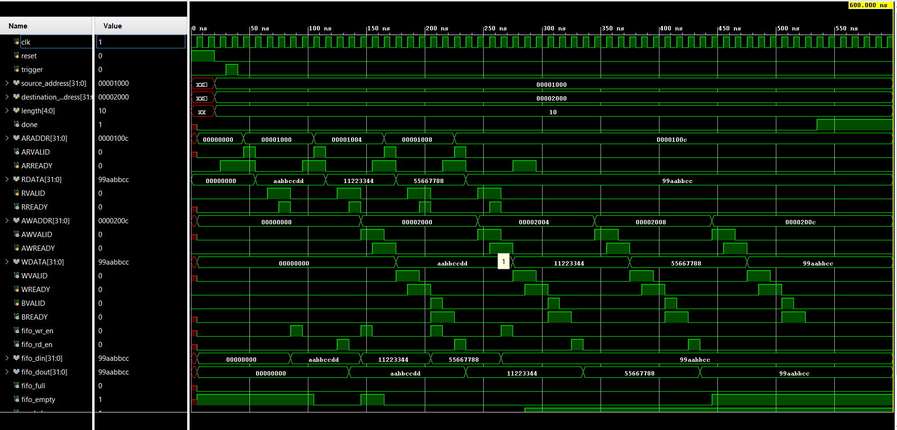

# MASTER DMA CONTROLLER (AXI-Lite Verilog)

This repository contains a fully functional **AXI-Lite based Master DMA Controller** implemented in Verilog. The design was developed as part of the **I-CHIP Electronics Engineering Society Challenge**. It autonomously transfers data between two memory regions using AXI-Lite handshaking and a synchronous FIFO buffer.

## 📌 Overview

In modern VLSI systems, minimizing CPU involvement in memory operations is crucial. Direct Memory Access (DMA) allows high-speed transfers without processor overhead. This project implements a **Master DMA Controller** that performs such transfers efficiently through:

- AXI-Lite protocol communication
- FIFO buffering
- Independent read and write state machines

## 🎯 Features

- ✅ Compliant with AXI-Lite read and write protocols  
- ✅ 16-depth, 32-bit wide synchronous FIFO buffer  
- ✅ Word-aligned address and transfer length  
- ✅ Concurrent read/write using separate FSMs  
- ✅ Handshake signals: `ARVALID`, `ARREADY`, `RVALID`, `RREADY`, `AWVALID`, etc.  
- ✅ `done` signal asserted on successful completion  
- ✅ Testbench with AXI-Lite memory model  
- ✅ Verified using Vivado simulation

## 📁 Project Structure

```
MASTER_DMA_CONTROLLER_VERILOG/
├── src/
│   ├── master_dma.v              # Main DMA controller module
│   └── sync_fifo.v               # Synchronous FIFO buffer
│
├── tb/
│   └── slave_test_bench.v        # AXI-Lite slave memory + DMA test logic
│
├── sim/
│   ├── simulation_result.wcfg    # Vivado waveform config
│   └── test_behav.wdb            # Simulation database
│
├── doc/
│   ├── Problem_Statement.pdf     # Official problem statement (PS1)
│   └── Waveform.png              # Screenshot of simulation results
│
└── VERILOG_MASTER_DMA_CONTROLLER.xpr  # Vivado project file
```


## 🛠️ How to Simulate (Vivado)

1. Open Vivado
2. Go to `File > Open Project`
3. Select `VERILOG_MASTER_DMA_CONTROLLER.xpr`
4. Run `Behavioral Simulation`
5. Open waveform (`simulation_result.wcfg`) to view results

## 🧪 Example Test Case

**Transfer Length**: 16 bytes (4 words)  
**Source Address**: 0x1000  
**Destination Address**: 0x2000  

### 🔹 Before DMA
**Source Memory:**
0x1000 : AABBCCDD
0x1004 : 11223344
0x1008 : 55667788
0x100C : 99AABBCC

**Destination Memory:**
0x2000 : 00000000
0x2004 : 00000000
0x2008 : 00000000
0x200C : 00000000


### 🔹 After DMA
**Destination Memory:**

0x2000 : AABBCCDD
0x2004 : 11223344
0x2008 : 55667788
0x200C : 99AABBCC


## 📷 Waveform



## 📄 Problem Statement

This project was implemented according to the challenge described in the official [Problem_Statement.pdf](doc/Problem_Statement.pdf) from the I-CHIP Electronics Engineering Society.

## 👨‍💻 Author

**Brijesh Ahirwar**  
Department of Electronics and Communication Engineering  
IIT (BHU) Varanasi  
📧 brijesh.ahirwar.iitbhu@gmail.com

## 📃 License

This project is provided for educational and academic use. License may be added upon public release.

